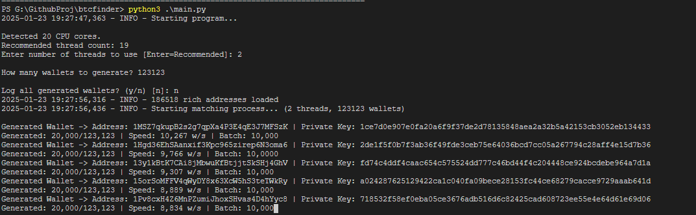

# Bitcoin Wallet Hunter

A highly efficient Bitcoin wallet generator and matcher that leverages parallel processing and sophisticated optimization strategies. This tool is designed to maximize performance by utilizing multiple CPU cores for concurrent wallet generation, ensuring rapid processing times. It incorporates advanced algorithms and data structures to enhance the matching process, allowing for quick identification of wallet addresses. The system is built with scalability in mind, capable of handling large datasets through optimized memory management techniques and asynchronous operations, making it suitable for both individual users and large-scale applications.





## 🚀 Features

- **Multi-Processing Architecture**
  - Utilizes Python's multiprocessing for parallel wallet generation
  - Optimized thread management based on CPU cores
  - Process pool implementation for batch operations
  - Dynamic batch size optimization based on performance metrics
  - Automatic thread count suggestion based on system capabilities

- **Advanced Memory Management**
  - Memory-mapped file operations for large datasets
  - Efficient memory allocation with deque data structures
  - Optimized buffer sizes for I/O operations
  - Memory usage monitoring and automatic optimization
  - Buffer-based wallet logging system

- **Performance Optimizations**
  - JIT compilation using Numba for critical computations
  - Concurrent batch processing of wallet generations
  - Asynchronous logging system with rotation
  - Collection-based data structures for faster operations
  - NumPy-based address matching for improved speed
  - Dynamic performance tuning during runtime

- **Robust Error Handling**
  - Graceful shutdown mechanisms
  - Comprehensive exception management
  - Automatic recovery systems
  - Safe interrupt handling with cleanup
  - Progress preservation on shutdown

- **Logging and Monitoring**
  - Optional wallet logging system
  - Real-time performance metrics
  - Progress tracking with detailed statistics
  - Rotated log files with compression
  - Configurable logging levels and formats

## 🛠 Technical Requirements

- Python 3.8+
- CPU with multiple cores (recommended)
- Minimum 4GB RAM (8GB+ recommended)

### Dependencies

```bash
bitarray>=2.8.3
bitcoin>=1.1.42
coincurve>=18.0.0
ecdsa>=0.18.0
base58>=2.1.1
tqdm>=4.66.1
concurrent-log-handler>=0.9.24
psutil>=5.9.8
numpy>=1.26.4
numba>=0.60.0
```

## 🔧 Installation

1. Clone the repository:
```bash
git clone https://github.com/yourusername/bitcoin-wallet-hunter.git
cd bitcoin-wallet-hunter
```

2. Install dependencies:
```bash
pip install -r requirements.txt
```

## 💻 Usage

### Basic Usage

```bash
python main.py
```

The program will prompt you for:
1. Number of threads to use (suggests optimal value)
2. Number of wallets to generate
3. Whether to log generated wallets (optional)

### Runtime Information

The program displays real-time information:
- Current progress and speed
- Batch size adjustments
- Memory usage statistics
- Found matches (if any)

### Output Files

- `found.txt`: Contains matched wallet addresses and private keys
- `wallets.log`: Optional log of all generated wallets
- `btcfinder.log`: Program execution logs and errors

## ⚡ Performance Tips

1. **Optimal Thread Count**
   - Use suggested thread count (CPU cores - 1)
   - Leave one core for system operations

2. **Wallet Logging**
   - Enable only when necessary
   - Affects disk I/O and overall performance
   - Uses buffered writing for efficiency

3. **Batch Size**
   - Automatically optimizes based on system performance
   - Adjusts dynamically during runtime
   - Can be monitored in real-time

## 🛡 Security Notes

- Private keys are handled securely
- Optional logging with user confirmation
- Safe shutdown mechanisms
- No external API dependencies

## ⚠️ Disclaimer

This tool is for educational purposes only. Users are responsible for ensuring compliance with local regulations regarding cryptocurrency operations. 